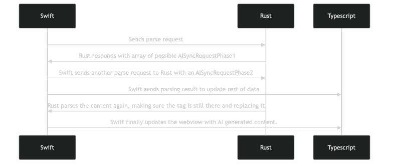

## Ai Serialization

- [ ] Swift _must_ respond to Typescript right away to avoid a massive slow down.
- [ ] Phase1 does not need to include any data other than the type of request that was parsed.
  - [ ] Remove this via Rust using the same regular expression after the reply has been sent to Typescript. Users expect a slower response when interacting with AI, but an onChange event (sending data back to Typescript) needs to be handled immediately.
- [ ] Once data is sent to Typescript, call Rust to get the note content with the actual AI trigger removed to not conflate the AI, send whatever request is needed to the FoundationModels, and once returned send the current note's content along with the structured result to Rust, replacing the content.
- [ ] Finally, update Typescript with the new data for the second time.

We don't even need to interact with Flatbuffers since no unique data is being sent to Typescript.

### General AI flow

1. User enters a 'fluster' code block.
2. The component is rendered with an included `execute` or similar button.

- This modifies the pre-parsed content only, allowing the parsed content to hold onto the code block that triggered the action.

3. When clicked, that button sends an `AiRequestPhase1` to Swift,
4. The input text is parsed to a structured enum, indicating what action if any should be taken.
5. This block gets parsed by Fluster, turning off the 'auto-render' feature.
