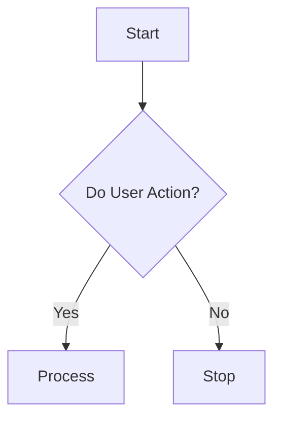

# Mermaid

## Example

````long-docs
It's not possible to show all of the things you can do with Mermaid, so please consult their documentation for more details.

Conundrum uses the `mmdflux` Mermaid renderer, which is **amazing** for it's support to output to a variety of targets, but this library does not support _all_ of mermaid.
````

````mdx

````

````long-docs
### Output:

The pre-rendered documentation will not update with your theme, _yet_, but your own notes will be themed to match your selected code block theme.


### Properties

| Property | Type | Description |
| -------- | ---- | ----------- |
| `themeDark` | SupportedSyntaxTheme |The theme while in dark mode. |
| `themeLight` | SupportedSyntaxTheme | The theme while in light mode. |
| `routing` | `ortho`, `direct` or `poly` | The routing method to be used. Defaults to the default chosen by mermaid, which varies by chart type. |
| `padding` | number | Padding around the image itself. |
| `nodePaddingX` | number | Padding around individual nodes. |
| `nodePaddingY` | number | Padding around individual nodes. |

````
